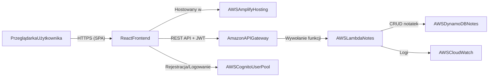
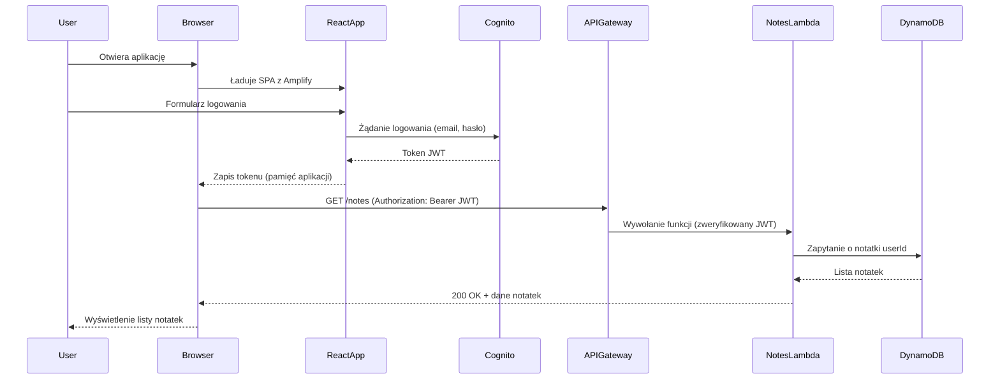

<!-- Zmiany: aktualizacja architektury na wariant serverless (API Gateway + Lambda zamiast App Runner), data: 2026-03-15 -->

---
name: architektura-systemu-notatek-aws
overview: Zaprojektowanie prostej, ale kompletnej architektury systemu do zarządzania notatkami na AWS z minimalnym, ale poprawnym użyciem usług chmurowych oraz przygotowanie wymaganych diagramów (przypadki użycia, architektura, model danych, przepływy).
---

### Cel

Celem jest przygotowanie pełnego, ale realistycznego (pod kątem czasu i złożoności) projektu architektury systemu do zarządzania notatkami dla studentów, opartego o AWS, z frontendem w React, backendem w Node.js oraz bazą DynamoDB. Wyjściem mają być gotowe koncepcje i szkice diagramów, które można przepisać do narzędzia typu draw.io/diagrams.net i załączyć do raportu.

### Założenia biznesowe

- **Główny użytkownik**: zalogowany student.
- **MVP** (zgodnie z kartą):
  - **Rejestracja i logowanie użytkowników** (oparte o AWS Cognito).
  - **Dodawanie notatek**.
  - **Edycja notatek**.
  - **Usuwanie notatek**.
  - **Oznaczanie priorytetu notatek** (np. `LOW`, `MEDIUM`, `HIGH`).
- **Dodatkowe funkcje**: świadomie **odpuszczone** na ten etap (tagi, przypomnienia, współdzielenie itd.).
- **Stack chmurowy**: prosty, minimalny, ale poprawny:
  - Frontend: React hostowany w AWS Amplify Hosting.
  - Backend: Node.js (REST API) w modelu serverless na AWS Lambda wywoływana przez Amazon API Gateway (bardziej Free Tier–friendly niż App Runner).
  - Autoryzacja: AWS Cognito (User Pool).
  - Baza danych: DynamoDB.
  - Monitorowanie/logi: CloudWatch (podstawowe).

### Proponowana architektura logiczna

- **Warstwa prezentacji (frontend)** – aplikacja React:
  - Moduły:
    - `AuthModule` (integracja z Cognito, logowanie, rejestracja, wylogowanie, obsługa tokenu JWT).
    - `NotesModule` (lista notatek, formularz dodawania/edycji, filtrowanie po priorytecie).
    - `UI/Layout` (nawigacja, komponenty wspólne).
  - Komunikacja z backendem przez REST API (HTTPS) z nagłówkiem `Authorization: Bearer <JWT>`.
- **Warstwa logiki (backend Node.js)** – funkcje serverless (AWS Lambda) za API Gateway:
  - Moduły:
    - `AuthMiddleware` – walidacja tokenu JWT z Cognito (może być częściowo realizowana przez API Gateway Authorizer, a częściowo w kodzie funkcji).
    - `NotesController` – obsługa operacji CRUD notatek i listowania, zaimplementowana jako zestaw funkcji Lambda (np. `getNotes`, `createNote`, `updateNote`, `deleteNote`) lub jedna funkcja rozpoznająca metodę/ścieżkę.
    - `NotesService` – logika biznesowa (mapowanie danych z/do DynamoDB, walidacja wejścia, reguły dot. priorytetu).
    - `NotesRepository` – operacje na DynamoDB (SDK v3).
    - `ErrorHandling/Logging` – mapowanie wyjątków na kody HTTP, logowanie do stdout (zbierane przez CloudWatch).
  - Wystawione endpointy (przykładowo):
    - `GET /api/notes` – pobierz notatki zalogowanego użytkownika.
    - `POST /api/notes` – utwórz notatkę.
    - `PUT /api/notes/:id` – edytuj notatkę.
    - `DELETE /api/notes/:id` – usuń notatkę.
- **Warstwa danych (DynamoDB)**:
  - Jedna główna tabela, np. `Notes`.
  - Klucz partycjonujący: `userId` (string), klucz sortujący: `noteId` (string/UUID).
  - Dodatkowe atrybuty: `title`, `content`, `priority`, `createdAt`, `updatedAt`.
  - Możliwe indeksy pomocnicze (opcjonalne, opisane w planie, ale niekonieczne w MVP).
- **Warstwa chmurowa i bezpieczeństwa (AWS)**:
  - **AWS Cognito User Pool** – zarządzanie użytkownikami, rejestracja/logowanie, odzyskiwanie hasła.
  - **Amazon API Gateway** – publiczne REST API, mapujące metody HTTP na funkcje Lambda oraz integrujące się z Cognito (JWT Authorizer).
  - **AWS Lambda** – wykonywanie logiki backendowej w modelu serverless (funkcje obsługujące operacje na notatkach).
  - **AWS DynamoDB** – trwałe przechowywanie notatek.
  - **AWS Amplify Hosting** – hosting frontendu React (build & deploy z repozytorium).
  - **AWS CloudWatch** – logi funkcji Lambda i API Gateway, podstawowe metryki.
  - Sieć: komunikacja po HTTPS; proste założenie: brak skomplikowanej sieci VPC w opisie, żeby nie komplikować raportu – w razie potrzeby można dodać jako „dalszy rozwój”.

### Model danych (koncepcja)

- **Encja `User`** (dane trzymane głównie w Cognito):
  - `userId` – `sub` z Cognito.
  - `email`.
  - `createdAt` (atrybut informacyjny; może być tylko po stronie Cognito lub w osobnej tabeli, ale w MVP można to pominąć).
- **Encja `Note`** (w DynamoDB):
  - `userId` – string, właściciel notatki.
  - `noteId` – string/UUID.
  - `title` – string.
  - `content` – string.
  - `priority` – enum: `LOW | MEDIUM | HIGH`.
  - `createdAt` – ISO timestamp.
  - `updatedAt` – ISO timestamp.
- Zależność: **User 1..N Note**.

### Diagramy do przygotowania

1. **Diagram przypadków użycia (Use Case Diagram)** – zakres funkcjonalny
  - Aktor: `Student` (opcjonalnie: `Administrator` – ale w MVP można go pominąć).
  - Główne przypadki użycia:
    - `Zarejestruj konto` (Cognito).
    - `Zaloguj się`.
    - `Wyloguj się`.
    - `Dodaj notatkę`.
    - `Przeglądaj notatki`.
    - `Edytuj notatkę`.
    - `Usuń notatkę`.
    - `Oznacz priorytet notatki` (może być jako część tworzenia/edycji lub osobny use case).
  - Relacje: `include` dla wspólnych kroków (np. „Uwierzytelnij użytkownika” używany przez inne przypadki).
2. **Diagram architektury systemu (Component/Deployment) – wariant serverless**
  - Styl: prosty diagram komponentów + rozłożenie na usługi AWS.
  - Elementy:
    - `UserBrowser` – przeglądarka użytkownika.
    - `ReactFrontend` hostowany w `AWS Amplify`.
    - `APIGateway` – warstwa REST API.
    - `NotesLambda` (lub kilka funkcji Lambda, np. `GetNotesLambda`, `CreateNoteLambda` itd.).
    - `CognitoUserPool`.
    - `DynamoDBTable`.
    - `CloudWatch`.
  - Przepływy:
    - `UserBrowser` → `ReactFrontend` (HTTPS, statyczne pliki).
    - `ReactFrontend` → `CognitoUserPool` (rejestracja/logowanie, pozyskanie tokenu).
    - `ReactFrontend` → `APIGateway` (REST API z JWT w nagłówku Authorization).
    - `APIGateway` → `NotesLambda` (wywołanie odpowiedniej funkcji).
    - `NotesLambda` → `DynamoDBTable` (operacje CRUD).
    - `NotesLambda` → `CloudWatch` (logi).
3. **Diagram modelu danych (ERD / prosty model logiczny)**
  - Encje `User` i `Note`.
  - Atrybuty jak wyżej.
  - Relacja 1..N.
  - Dodatkowo można zaznaczyć, że dane użytkownika są faktycznie przechowywane w Cognito, a w tabeli `Notes` klucz `userId` pochodzi z Cognito.
4. **Diagram przepływu (Sequence / Flow) dla kluczowych scenariuszy – wariant serverless**
  - Co najmniej 2 sekwencje:
  1. **Logowanie użytkownika i uzyskanie dostępu do notatek**:
    - `User` → `ReactFrontend` → `CognitoUserPool` → z powrotem do frontendu z tokenem → `ReactFrontend` → `APIGateway` (GET `/notes`) → `NotesLambda` → `DynamoDB`.
  2. **Dodanie/edycja notatki z priorytetem**:
    - `User` → `ReactFrontend` (formularz notatki) → `APIGateway` (POST/PUT `/notes` lub `/notes/{id}`) → `NotesLambda` → `DynamoDB` → odpowiedź sukces → odświeżenie listy notatek.

### Propozycja diagramu architektury w mermaid (do wklejenia w narzędzie wspierające mermaid)

### Propozycja diagramu sekwencji (logowanie i pobranie notatek)

### Propozycja diagramu ERD (opis tekstowy)

- `User(userId [PK], email)` – dane w Cognito, w ERD zaznaczyć jako byty logiczne.
- `Note(userId [PK, FK → User.userId], noteId [SK], title, content, priority, createdAt, updatedAt)`.
- Relacja: `User (1) --- (N) Note`.

### Zakres dokumentacji opisowej (do raportu)

- **Opis architektury** (na bazie powyższego planu, wariant serverless):
  - Krótki opis roli każdej usługi AWS.
  - Uzasadnienie wyboru Lambda + API Gateway vs usługi kontenerowe (np. App Runner): korzystniejsze warunki Free Tier, brak konieczności zarządzania instancjami, automatyczne skalowanie na żądanie.
  - Uzasadnienie wyboru DynamoDB (prosty, kluczowy model danych, niski narzut operacyjny, dobrze pasuje do wzorca userId + noteId).
- **Opis bezpieczeństwa**:
  - Użycie Cognito jako głównego źródła tożsamości.
  - Wymóg tokenu JWT do wywołań backendu.
  - Brak przechowywania haseł po stronie backendu.
- **Opis przepływów** dla najważniejszych przypadków użycia (logowanie, przeglądanie notatek, dodawanie/edycja/usuwanie).

### Dalszy rozwój (opcjonalne rozszerzenia)

- Dodanie **tagów** do notatek (nowe pole `tags` w tabeli).
- Dodanie **wyszukiwarki/filtrowania** po tytule, treści, priorytecie.
- Dodanie **przypomnień** (np. AWS EventBridge + Lambda + e-mail/SNS).
- Dodanie **przechowywania załączników** (AWS S3) z referencjami w notatce.
- Rozszerzenie monitoringu (metryki aplikacyjne w CloudWatch, alarmy).

